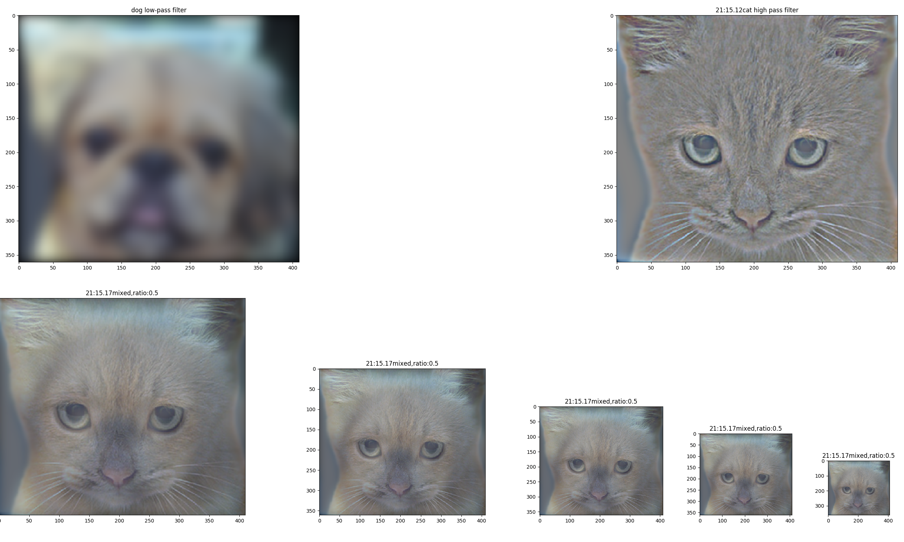
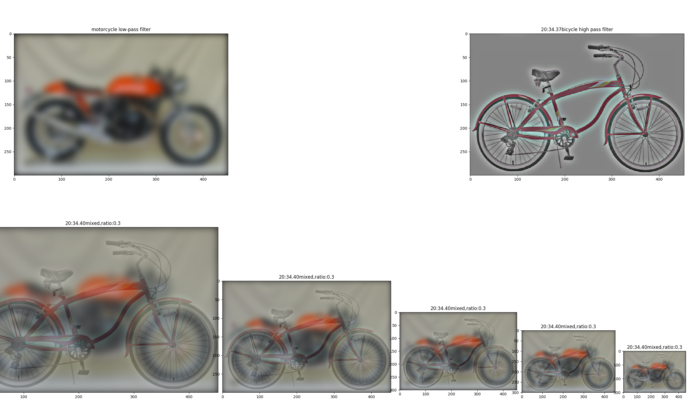
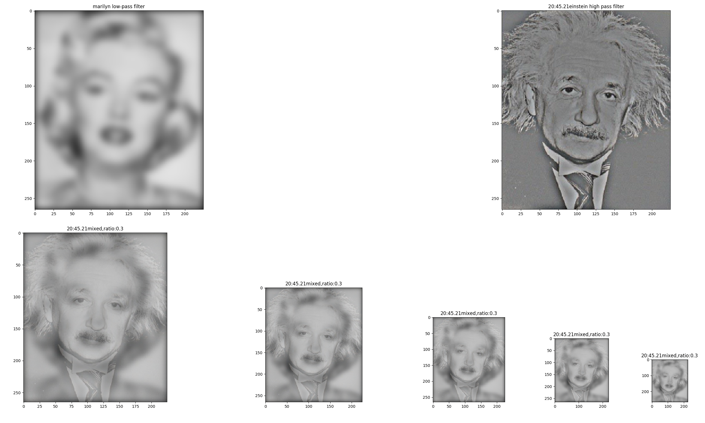
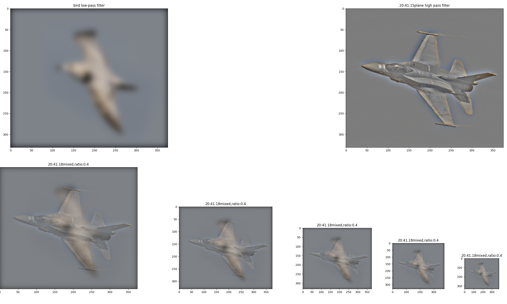
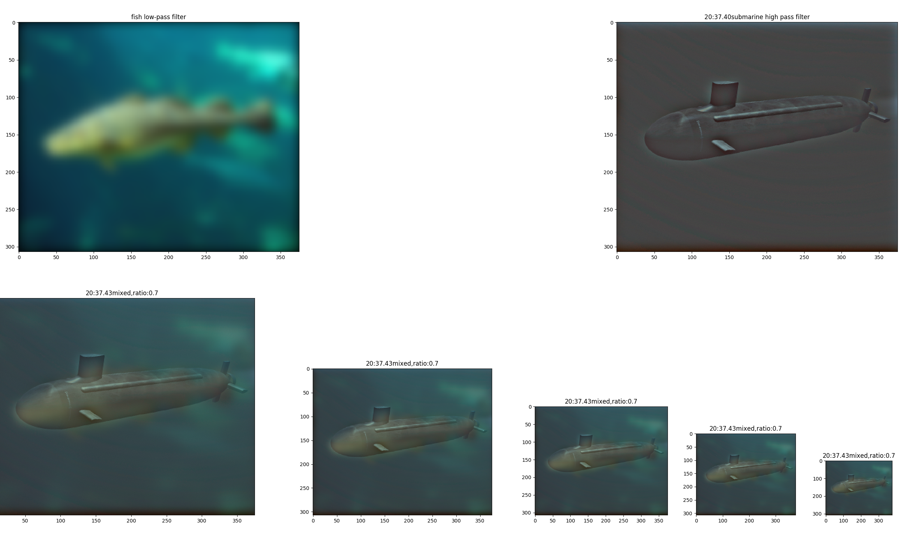

# Coursework 1: Image Filtering and Hybrid Images

## Aim
1. Implement the convolution operator with regular method and fourier method.
2. Implement Gaussian kernels so as to implement low pass filter as well as high pass filter
3. Mix two different images with summing up low pass filtered version of first image and high pass filtered version of
 second image.But the "cut-off frequency" should be chosen carefully.

## Language and Environment
* Language:Python 3.5
* Library Dependencies:See [requirement.txt](requirements.txt)
* IDE:Pycharm
* Github address: [https://github.com/weiziyoung/cv_homework](https://github.com/weiziyoung/cv_homework)


## Implement Method

####Kernel Class

Since we need to do convolution operation very frequently, so I define a Kernel class in order to do that.
With that Kernel, we could create arbitrary shape template. For example, the Gaussian Kernel is inherited from this class.

```
class Kernel(object):
    """
        The Template of Kernel.
    """
    array = None
    shape = None

    def __init__(self, array):
        try:
            if isinstance(array, list):
                array = np.array(array)
            self.shape = array.shape
            if len(self.shape) != 2:
                raise ShapeException('The input shape must be a M*N matrix or 2D list')
            if not self.shape[0] % 2 or not self.shape[1] % 2:
                raise ShapeException('M or N must be an odd number')
            self.array = array
        except Exception as e:
            raise Exception(e)

    def __str__(self):
        return '{M} * {N} Kernel: \n {Array}'.format(M=self.shape[0], N=self.shape[1], Array=self.array)

    def __repr__(self):
        return self.__str__()
```

####Image Class
In addition to Kernel, the image class is also a basic unit in this project.As for this assignment, I define the necessray methods:
The given varibles are easily to be understood.Detailed method will be given in the next section.

```
class Image(object):
    pixels = [[]]
    shape = (0, 0, 0)  # if it is an RGB picture, shape will be a three-tuple
    size = (0, 0)  # M * N
    img_name = ''
    is_grey = False
    low_pass = None

    def __init__(self, matrix=None, image_path=None, name=None):
    ...

    def __repr__(self):
    ...

    def __str__(self):
        return self.__repr__()

    def __mul__(self, other):
        ...

    def show(self, plot_loc=None):
        ...

    def mix(self, image, ratio: float):
       ...

    def convolute(self, kernel, fourier=None):
        ...

    def __base_convolution(self, kernel):
        ...

    def __fourier_convolution(self, kernel):
        ...

    def low_pass_filter(self, sigma, size=None, fourier=False):
        ...

    def high_pass_filter(self, sigma=None, size=None, fourier=None):
        ...
```
####Basic Convolution Method
Below gives the implemention of basic convolution method.In order to be compatible with the grey image, I treat it and RGB images with different way.
Notice that it is very slow and time-consuming since it is writtern by Python.So, I hardly use this method.

```
def calculate(matrix1, matrix2):
    """
    :param matrix1:ndarray
    :param matrix2:ndarray, contains the weight parameter
    :return:matrix1 .* matrix2
    """
    if matrix1.shape != matrix2.shape:
        raise Exception('The shape of Matrix1 and matrix2 should be same')
    return np.dot(matrix1.flatten(), matrix2.flatten().T)


def __base_convolution(self, kernel):
    """
    Convolution calculation using standard loop(fast when the kernel size is small)
    :param kernel: The template of kernel
    :return: The output image that is convoluted by this kernel
    """
    # Initializing some parameters, since convolution is time-consuming, grey and RGB should be treated differently.
    if self.is_grey:
        pixels_list = [self.pixels]
    else:
        pixels_list = [self.pixels[:, :, i] for i in range(3)]
    channel_list = []

    for pixels in pixels_list:
        output_matrix = np.zeros(self.size)
        # Create a extension matrix based on the size of kernel, so as to do the convolution operation
        extra_m, extra_n = kernel.shape[0]//2, kernel.shape[1]//2
        temp_size = (self.shape[0] + extra_m * 2, self.shape[1] + extra_n * 2)
        temp_pixels = np.zeros(temp_size)
        temp_pixels[extra_m:extra_m+self.shape[0], extra_n:extra_n + self.shape[1]] = pixels

        # Start loop!
        for y_index, y in enumerate(range(extra_m, self.shape[0] + extra_m)):
            for x_index, x in enumerate(range(extra_n, self.shape[1] + extra_n)):
                temp_matrix = temp_pixels[y-extra_m:y+extra_m+1, x-extra_n:x+extra_n+1]
                temp_result = calculate(temp_matrix, kernel.array)
                output_matrix[y_index, x_index] = temp_result
        channel_list.append(output_matrix)

    # return output image, treat grey and RGB pic separately
    if self.is_grey:
        return Image(channel_list[0])
    else:
        output = np.zeros(self.shape)
        for i in range(3):
            output[:, :, i] = channel_list[i]
        return Image(matrix=output)
```

####Fourier Convolution method
There is another way to implement convolution operation.The detailed method is given below.
In order to multiply the two matrix, their size should be the same.So, I added the padding to the kernel with zero.

```
    def __fourier_convolution(self, kernel):
        """
        A more faster convolution way when the size of kernel is large
        :param kernel:The template of kernel
        :return:The output image that is convoluted by this kernel
        """
        # Create a padding matrix:
        output_matrix = np.zeros(self.size if self.is_grey else self.shape)
        for channel in range(1 if self.is_grey else 3):
            pixels = self.pixels[:, :, channel] if not self.is_grey else self.pixels
            padding_matrix = np.zeros(self.size)
            start_point = (self.shape[0]//2 - kernel.shape[0]//2, self.shape[1]//2 - kernel.shape[1]//2)
            padding_matrix[start_point[0]:start_point[0]+kernel.shape[0],
                           start_point[1]:start_point[1]+kernel.shape[1]] = kernel.array
            image_transform = (fft.fft2(pixels))
            template_transform = (fft.fft2(padding_matrix))
            inverted_transform = np.abs(fft.fftshift(fft.ifft2(image_transform * template_transform)))
            if not self.is_grey:
                output_matrix[:, :, channel] = inverted_transform
            else:
                output_matrix = inverted_transform
        return Image(matrix=output_matrix)
```
#### How to choose the convolution method
According to the Mark Nixon's book(p.87 3rd version),If m² < 4*log(N) + 1,we should prefer regular method, otherwise, the fourier convolution should be chosen.
The related code is given below:

```
    def convolute(self, kernel, fourier=None):
        """
        The implement of convolution.
        It will choose a better algorithm to do it depends on the size of kernel and image.

        :param kernel:
        :param fourier:Whether use fourier transform to calculate the convolution
        :return:
        """
        if not isinstance(kernel, Kernel.Kernel):
            try:
                kernel = Kernel.Kernel(kernel)
            except Exception:
                raise Exception('The input must be a kernel')

        kernel_size = kernel.shape[0] * kernel.shape[1]
        image_size = np.sqrt(self.shape[0] * self.shape[1])
        if fourier is not None:
            if fourier:
                return self.__fourier_convolution(kernel)
            else:
                return self.__base_convolution(kernel)

        # According to the Mark Nixon's book(p.87 3rd version),If m² < 4*log(N) + 1,
        #  then we should use direct implementation, otherwise the fourier transform should be considered.
        else:
            if kernel_size < 4 * np.log(image_size) + 1:
                return self.__base_convolution(kernel)
            else:
                return self.__fourier_convolution(kernel)
```
####Hybrid image algorithms
To hybrid images, we need to get the low-pass version of image1 and high-pass version of image2.
Then, the cut-off frequency should be given so as to controls how much high frequency to remove from the first image 
and how much low frequency to leave in the second image.The paper suggests us to use two cut-off frequency,while I think
one frequency is good enough, because the another frequency can be calculated.
Notice that when one is grey image,while another is RGB image, we should convert the grey image into RGB image.
```
    def mix(self, image, ratio: float):
        """
        Mix this image with another image
        :rtype: Image
        """
        def grey2RGB(pixels):
            result = np.zeros((pixels.shape[0], pixels.shape[1], 3))
            for i in range(3):
                result[:, :, i] = pixels
            return result
        if self.shape != image.shape:
            if len(self.shape) != 3:
                self.pixels = grey2RGB(self.pixels)
            elif len(image.shape) != 3:
                image.pixels = grey2RGB(image.pixels)
        return Image(self.pixels * ratio + image.pixels * (1-ratio),
                     name='mixed,ratio:{ratio}'.format(ratio=ratio))
```

##Demo
The main.py file has told you how to operate images.In this assignment, I mixed ten images that are given in the data file to five output images.
I adapted different cut-off frequency in each hybrid image so as to get the best result.The output images has been displayed in file "output/".

1.dog + cat
2.bike + motor
3.Einstein + Marilyn
4.blane + bird
5.submarine + fish


